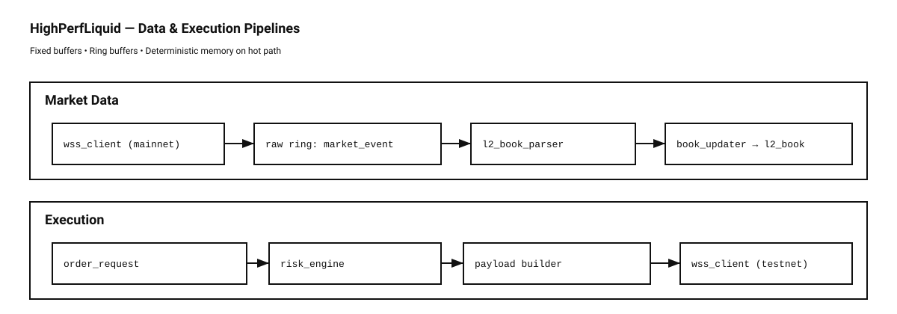

# HighPerfLiquid

HighPerfLiquid is a **high-performance C++20 client library for Hyperliquid**, built with a focus on **ultra-low-latency market data ingestion** and a clean foundation for **HFT-style order book systems**.

The goal of this project is to be a production-grade C++ codebase that stays:

* deterministic
* allocation-aware
* tooling-clean
* structured like real infra (not a quick script)

Right now the library supports:

* WebSocket market data ingestion
* Fast JSON parsing using simdjson
* Typed L2 book level events (bid/ask)
* Ring-buffer based event pipeline

Order book + trading features are coming next.

---

## Current Results
- CPU: Intel i5-9600KF
- OS: Ubuntu 22.04 (kernel 6.x)
- Compiler: clang++ 17
- Build: Release

|                    Benchmark | Throughput (msg/s) |     Mean |    p50 |    p99 |   p999 | Notes                |
| ---------------------------: | -----------------: | -------: | -----: | -----: | -----: | -------------------- |
| Socket Parser (20×20 snapshot) |               9153 | 107.8 µs |  65 µs | 131 µs | 262 µs | simdjson ondemand    |
|     Updater (40 levels) |            359,956 |  1.82 µs | 1–2 µs | 1–2 µs |  16 µs | snapshot overwrite   |
|          End-to-end pipeline |               9141 | 108.7 µs |  65 µs | 131 µs | 262 µs | dominated by parsing |

## Why this exists

Most exchange API wrappers are either:

* too slow / too high-level
* full of dynamic allocations
* messy architecture (networking + parsing + logic mixed together)
* hard to extend into real trading infra

This project is meant to be the opposite:

* strict layering
* hot-path friendly
* minimal overhead
* built step-by-step like a real system

---

## Current Pipeline




## Supported Messages

At the moment the parser handles:

* `channel = "l2Book"`

Hyperliquid schema:

* `levels[0]` → bids
* `levels[1]` → asks

Each level produces one event:

```cpp
struct l2_level_event {
    symbol_t    symbol;        // fixed 5-char symbol
    side        level_side;    // bid / ask
    price_t     price;         // fixed-point (1e6)
    qty_t       size;          // fixed-point (1e6)
    uint32_t    order_count;
    uint64_t    exchange_time_ms;
};
```

Prices/sizes are parsed deterministically as fixed-point integers (no floats).

---

## Build

Clone and build with standard CMake:

```bash
git clone https://github.com/elhamidimed/HighPerfLiquid
cd HighPerfLiquid

cmake -S . -B build -DCMAKE_BUILD_TYPE=Release
cmake --build build
```

---

## Sanity Test

A small executable exists to verify parsing works:

```bash
./build/examples/live_l2book 
```

Expected output:

```
t=1772135275363 bid=28550000 x 26460000 | ask=28551000 x 204630000
t=1772135275895 bid=28550000 x 168370000 | ask=28551000 x 204630000
t=1772135276432 bid=28550000 x 168370000 | ask=28551000 x 204630000
t=1772135276973 bid=28550000 x 168370000 | ask=28551000 x 204630000
```
---

## Tooling Notes

This repo is intentionally strict:

* warnings treated as errors
* clang-tidy enabled
* simdjson vendored under `third_party/`
* third_party code is excluded from linting/werror

Everything is meant to compile cleanly under modern compilers.


---

## Note

This is still under active development.
Not ready for live trading yet. the order book + execution layers are still coming.


